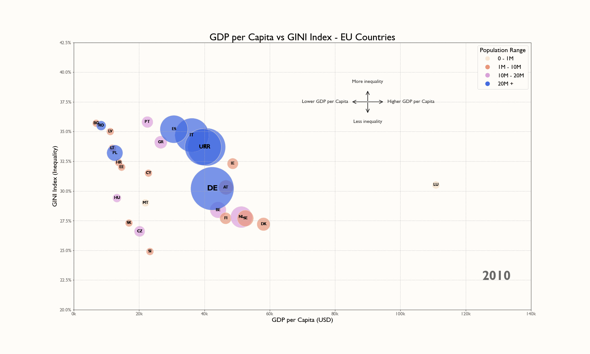

# data-viz-projects

A collection of data visualization projects — from animated charts to interactive maps and creative visual experiments.

---

## Projects

### 🌍 [Merry Christmas in European Languages](./rodatatribe-merry-christmas-2023/)
*Romanian Data Tribe Challenge — December 2023*

An interactive map exploring the etymology of Christmas greetings across European languages — are they rooted in Christ's name, or do they trace back to pagan origins?

---

### 📊 [GDP per Capita vs GINI Index — EU Countries](./EU_GINI_GDPPC/)
*Animated bubble chart — EU economic inequality over time*

An animated scatter plot comparing GDP per capita and income inequality (GINI index) across EU countries, with bubble size representing population.

---

### ❄️ [SQL Snow](./sql_snow/)
*A creative ASCII snowfall animation built in Python*

A generative visual experiment producing a falling snow effect using ASCII characters.

