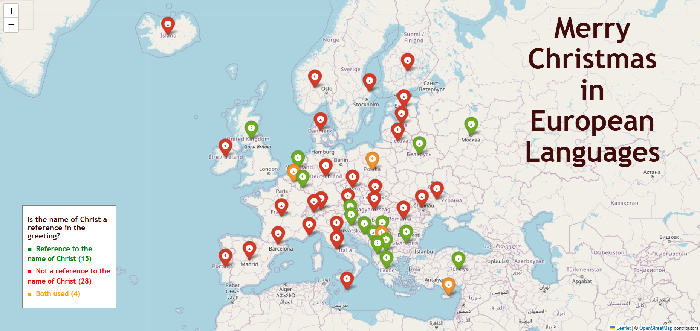
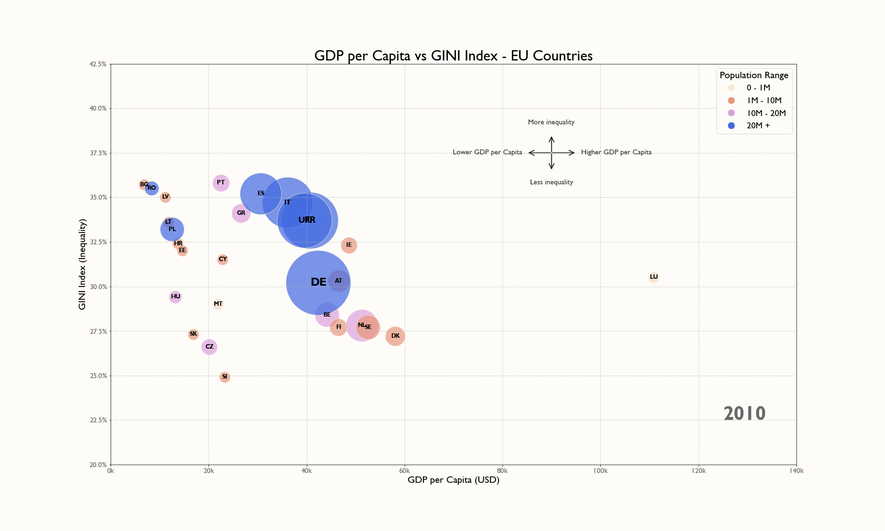

# data-viz-projects
A collection of data visualization projects: from animated charts to interactive maps and creative visual experiments. Built across a mix of tools and languages: Python, SQL, HTML, Jupyter Notebooks and traditional BI platforms.

---

## Projects

### 🌍 [Merry Christmas in European Languages](./rodatatribe-merry-christmas-2023/)
*Romanian Data Tribe Challenge - December 2023*

An interactive map exploring the etymology of Christmas greetings across European languages - are they rooted in Christ's name or do they trace back to pagan origins?

---

### 📊 [GDP per Capita vs GINI Index - EU Countries](./eu-gini-gdppc/)
*Animated bubble chart - EU economic inequality over time*

An animated scatter plot comparing GDP per capita and income inequality (GINI index) across EU countries, with bubble size representing population.

---

### ❄️ [SQL Snow](./sql-snow/)
*A creative ASCII snowfall animation built in Python and SQL*

A generative visual experiment producing a falling snow effect using ASCII characters - a cheap replacement for no white Christmas 😄.

---

### 🛣️ [Romanian Highway Progress](./romanian-highway-progress/)
*Romanian DataViz Challenge - March 2026*

An interactive ISO technical drawing–style dashboard tracking Romania's 17 highway and expressway corridors - open km, under construction, and remaining - plus a yearly openings chart from 1972 to 2025.

**[Live demo ->]([https://irinel47.github.io/data-viz-projects/romanian-highway-progress/](https://rawcdn.githack.com/Irinel47/data-viz-projects/main/romanian-highway-progress/index.html))**
