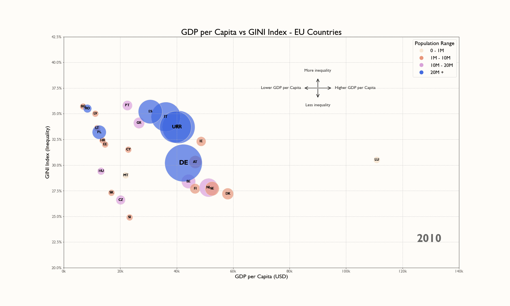

# GDP per Capita vs GINI Index - EU Countries

Recently, I came across a Hans Rosling chart with an amazing style and that inspired me to work on this project. I wanted to explore how wealth and inequality are distributed across European Union countries in a visually engaging way.

## What's in the chart?

- **GDP per Capita** (X-axis) — how rich a country is per person
- **GINI Index** (Y-axis) — measures income inequality (higher = more unequal)
- **Bubble size** — Total GDP of each country
- **Bubble color** — Population size

## 🔍 What Does It Show?

- Nordic countries (Denmark, Finland, Sweden) have strong economies with relatively low inequality
- Germany, France and Italy are economic powerhouses (biggest bubbles), but their inequality levels vary
- Luxembourg & Ireland stand out for their high GDP per capita
- Southern & Eastern European countries (Bulgaria, Romania, Baltics) tend to have higher inequality and lower GDP per capita — poorer countries where a smaller proportion of the population controls a larger share of the economy

Hans Rosling made data fun and accessible and I hope this chart does the same! 🌟

## 🛠️ Tools & Libraries

- Python
- Matplotlib
- Pandas

## 📌 Data Source

[World Bank](https://data.worldbank.org/)

---

*What do you think? Any surprises?*
