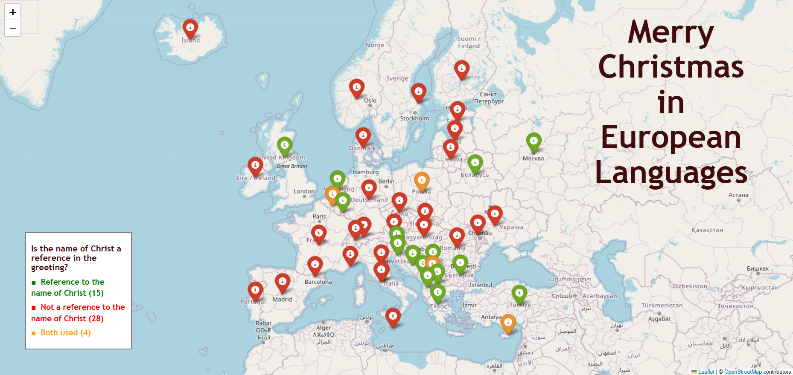

# Merry Christmas in European Languages
*Romanian Data Tribe - X-Mas Data Viz Challenge, December 2023*

In the 'Merry Christmas in European Languages' challenge, I delved deep into the etymology of native greetings.

My point of focus was: "Is the origin of the greeting linked to the name of Christ or is it of pagan origin?"

The main idea expressed in several languages is related to birth, creation, winter, solstice, new times and so on (apart from those that obviously refer to Christ/God).

Unraveling the linguistic roots revealed a spectrum of origins - from ancient pagan ties within Indo-European, Latin, Norse, Germanic and Celtic cultures to those embracing Christ's pure essence. 🌍✨

Check out the "etymological expedition" as we uncover the hidden layers behind these festive salutations! 🤔🎁

🍪 [Dynamic experience](https://rawcdn.githack.com/Irinel47/RoDataTribe_MerryChristmass/7e141b0e88c68e4cd9084ed156039e1cf969b4ef/european_christmas.html)

🍪 [Dataset](https://data.world/romanian-data/merry-christmas-in-european-languages)
