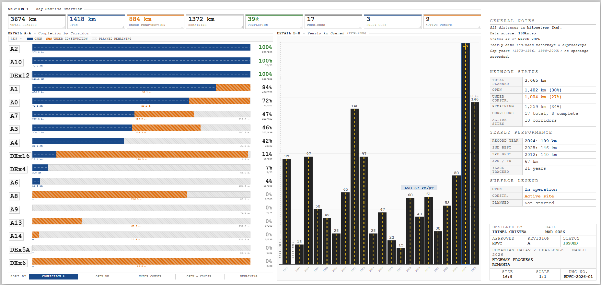

# Romanian Highway Progress — March 2026 DataViz Challenge

Interactive visualization of Romania's highway and expressway network progress.

**[Live demo →](https://rawcdn.githack.com/Irinel47/data-viz-projects/main/romanian-highway-progress/index.html)**

## About

Built for the [Romanian DataViz Challenge — March 2026](https://www.linkedin.com/pulse/dataviz-challenge-march-2026-romaniandata-dcv6c/), this dashboard visualizes the state of Romania's planned highway and expressway network across 17 corridors (until 2025).

## Features

- KPI cards: total planned, open, under construction, remaining km
- Sortable corridor completion bars (by %, open km, active construction, remaining)
- Yearly km opened chart (1972–2025) with average reference line
- ISO 7200 technical drawing aesthetic
- Fully responsive, no dependencies

## Data source

[130km.ro](https://130km.ro) — status as of March 2026

## Tech

Single-file HTML/CSS/JS — no frameworks, no build step.
